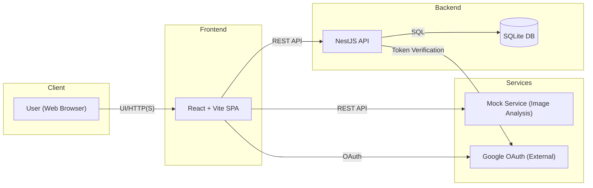
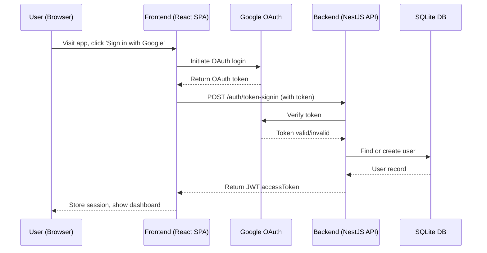
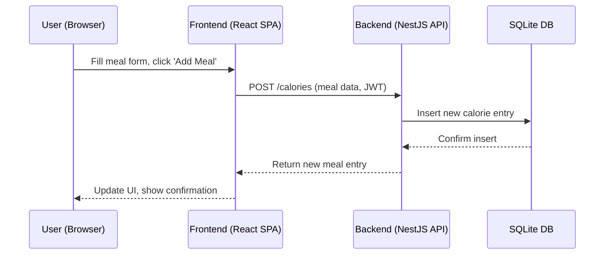
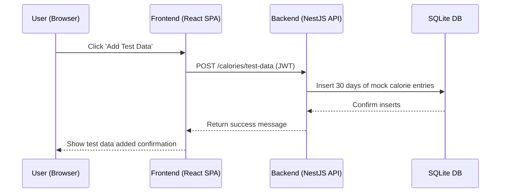
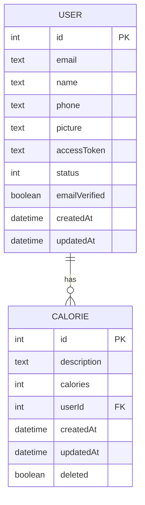

# Product Specification Document (PSD)

> **Product Name:** Calorie Tracker  
> **Version:** 1.0  
> **Author:** Nilesh Modi  
> **Date:** 2025-07-15  

---

## Revision History

| Date       | Version | Author       | Notes                         |
|------------|---------|--------------|-------------------------------|
| 2025-07-15 | 0.1     | Nilesh Modi  | Initial draft                 |
| 2025-07-15 | 1.0     | Nilesh Modi  | Final release                 |

---

## Table of Contents

1. [Introduction](#introduction)  
2. [Product Overview](#product-overview)  
3. [Goals & Success Metrics](#goals--success-metrics)  
4. [Scope](#scope)  
   - [In‑Scope](#in‑scope)  
   - [Out‑of‑Scope](#out-of-scope)  
5. [User Personas](#user-personas)  
6. [User Stories & Use Cases](#user-stories--use-cases)  
7. [Functional Requirements](#functional-requirements)  
8. [Non‑Functional Requirements](#non-functional-requirements)  
9. [System Architecture](#system-architecture)  
10. [Data Model](#data-model)  
11. [UI/UX Mockups (optional)](#uiux-mockups-optional)  
12. [Acceptance Criteria](#acceptance-criteria)  
13. [Constraints & Assumptions](#constraints--assumptions)  
14. [Glossary](#glossary)  
15. [Appendices](#appendices)  

---

## 1. Introduction

Calorie Tracker is a web-based application designed for personal use, enabling individuals to monitor and manage their daily calorie intake with maximum simplicity and privacy. Unlike many calorie trackers, this product emphasizes a distraction-free, ad-free experience, with no social features or third-party integrations, ensuring that user data remains private and usage is frictionless. The application is optimized for both desktop and mobile browsers, and is accessible to users of all ages and abilities, with a modern, responsive UI and support for light/dark themes.

- **Background:** Calorie tracking is essential for individuals aiming to manage weight, improve health, or monitor dietary habits. Calorie Tracker was created to provide a fast, user-friendly, and secure way to log meals and visualize calorie consumption, without the complexity or privacy concerns of larger platforms. The product’s philosophy is to empower users to take control of their diet with minimal barriers and maximum transparency.
- **Audience:** Any individual interested in tracking their diet or calorie plan, regardless of age, technical skill, or dietary goal. The app is designed to be accessible to everyone, including those with accessibility needs, and works seamlessly on both desktop and mobile devices.
- **Unique Value Proposition:**
  - 100% privacy: No data sharing, no ads, no social features
  - Simple, intuitive interface for quick meal logging
  - Google-based authentication for secure, passwordless access
  - Instant test data generation for demo or onboarding
  - Modern, accessible UI with theme toggle
- **Definitions / Acronyms:**
  - **PSD:** Product Specification Document
  - **API:** Application Programming Interface
  - **JWT:** JSON Web Token

---

## 2. Product Overview

- **What is the product?**  
  Calorie Tracker is a privacy-first, web-based application that enables users to log, view, and analyze their daily calorie intake with minimal friction. The product is designed for fast, distraction-free use, with a focus on user empowerment and data privacy.
- **Who is it for?**  
  Any individual interested in tracking their calories for personal health and diet management, regardless of age, technical skill, or dietary goal. The app is optimized for both desktop and mobile browsers and is accessible to users with varying abilities.
- **Unique Selling Points:**
  - No ads, no social features, and no third-party data sharing
  - Google-based authentication for secure, passwordless access
  - Instant test data generation for onboarding or demo
  - Modern, responsive UI with light/dark theme toggle
  - Accessible design for all users, including those with disabilities
  - Open, transparent data model (no hidden analytics or integrations)
- **Intended Use Cases & Environments:**
  - Personal calorie and meal tracking for weight management or health goals
  - Quick onboarding and demo via test data generation
  - Use on any modern browser (desktop, tablet, or mobile)
  - Suitable for users with accessibility needs (keyboard navigation, high-contrast themes)

| Key Feature                | Description                                      |
|---------------------------|--------------------------------------------------|
| Google OAuth Login        | Secure, passwordless authentication               |
| Add/Edit/Delete Meals     | Full CRUD for meal entries                        |
| Calorie Visualization     | Bar chart of daily calorie totals                 |
| Test Data Generation      | One-click mock data for 30 days                   |
| Theme Toggle              | Light/dark mode for comfort and accessibility     |
| Responsive UI             | Works on desktop, tablet, and mobile              |
| Privacy-first             | No ads, no social, no data sharing                |

---

## 3. Goals & Success Metrics

- **Goal 1:** Enable users to easily log and review their calorie intake.  
  - *Metric:* At least 90% of active users log one or more meals per day.
- **Goal 2:** Provide clear visual feedback on calorie trends.  
  - *Metric:* 80% of users visit the stats/charts page at least once per week; average chart interaction time > 30 seconds per session.
- **Goal 3:** Ensure secure, reliable, and accessible experience.  
  - *Metric:* 99.9% uptime; <1% error rate on API calls; >95% successful login rate.
- **Goal 4:** Collect actionable user feedback for continuous improvement.  
  - *Metric:* At least 10% of users provide feedback via in-app survey or NPS per quarter.

---

## 4. Scope

### In‑Scope (Implemented Features)
- [x] User authentication via Google OAuth
- [x] Add, edit, delete, and view calorie entries (CRUD)
- [x] Visualization of calorie data (bar chart by day)
- [x] Test data generation for user accounts (last 30 days)
- [x] Responsive web UI with theme toggle (light/dark)
- [x] Accessible design for users with disabilities
- [x] Secure, privacy-first data handling (no sharing, no ads)

### Out‑of‑Scope
- [ ] Integration with wearables or external health apps
- [ ] Social features (sharing, friends, leaderboards, etc.)
- [ ] Nutrition analysis beyond calories (macros, vitamins, etc.)
- [ ] Planned/desired features not present in the codebase
- [ ] Multi-user or admin roles

### Future Considerations (Not in Current Version)
- Integration with fitness trackers or health apps
- Advanced nutrition analysis (macronutrients, micronutrients)
- Social or community features (sharing, challenges)
- Data export/import options
- Mobile app (native) version

**Note:** The PSD covers only features present in the current codebase. Any future features will be documented in subsequent versions.

---

## 5. User Personas

| Persona         | Description                                   | Age Range | Tech Savvy | Dietary Goals         | Accessibility Needs      | Device Usage         |
|----------------|-----------------------------------------------|-----------|------------|----------------------|-------------------------|----------------------|
| Everyday User  | Any individual tracking their calorie intake   | 16–70+    | All levels | Weight mgmt, health  | May require high-contrast, keyboard navigation, or screen reader | Desktop, Mobile, Tablet |

**Persona Narrative:**
- The typical user is someone who wants to monitor their daily calorie intake for personal health, weight management, or dietary awareness. Users may range from tech-savvy young adults to older individuals with limited technology experience. Some users may have accessibility needs, such as requiring high-contrast themes or keyboard navigation.

**Inclusivity & Accessibility:**
- The application is designed to be inclusive and accessible to all users, regardless of age, technical skill, or physical ability. It works seamlessly on both desktop and mobile browsers, and supports accessibility features such as keyboard navigation and theme toggling for visual comfort.

---

## 6. User Stories & Use Cases

### User Story Template
> **As a** `<persona>`  
> **I want to** `<action>`  
> **So that** `<benefit>`

**User Stories (with Functional Requirement Mapping):**
| # | User Story                                                                                                   | FR  |
|---|-------------------------------------------------------------------------------------------------------------|-----|
| 1 | As a **User**, I want to sign in with my Google account, so that my data is secure and personalized.        | FR-1|
| 2 | As a **User**, I want to add a meal with a description and calorie value, so that I can track what I eat.   | FR-2|
| 3 | As a **User**, I want to edit or delete a meal entry, so that I can correct mistakes or remove unwanted data.| FR-3|
| 4 | As a **User**, I want to view my calorie intake over different timeframes (1W, 2W, 4W), so that I can monitor trends.| FR-4|
| 5 | As a **User**, I want to generate test data, so that I can see how the app works with sample entries.        | FR-5|
| 6 | As a **User**, I want to switch between light and dark themes, so that I can use the app comfortably in any environment.| FR-6|
| 7 | As a **User**, I want to be logged out if my session expires or is invalid, so that my data remains secure. | FR-7|
| 8 | As a **User**, I want to see error messages if login fails or if I try to access unauthorized pages.         | FR-8|
| 9 | As a **User**, I want to recover gracefully from a failed image analysis or network error, so that I am not blocked from using the app. | FR-8|
|10 | As a **User**, I want to receive clear feedback if I enter invalid data, so that I can correct mistakes easily. | FR-8|

### User Journey Map
1. **Visit App:** User lands on the login page (desktop or mobile).
2. **Authenticate:** User signs in with Google OAuth.
3. **Dashboard:** User sees stats and meal log.
4. **Add/Edit/Delete Meal:** User logs a meal, edits, or deletes an entry.
5. **View Trends:** User views calorie trends via bar chart (1W, 2W, 4W).
6. **Generate Test Data:** User generates test data for demo/testing (optional).
7. **Theme Toggle:** User switches between light and dark mode (optional).
8. **Session Handling:** User is logged out automatically if session expires or is invalid.
9. **Error Handling:** User receives clear error messages for failed login, unauthorized access, or invalid input.

**Note:** All user stories are based on features present in the current codebase and mapped to functional requirements for traceability.

---

## 7. Functional Requirements

| ID   | Requirement                                                                 | Owner     | User Story # |
|------|-----------------------------------------------------------------------------|-----------|--------------|
| FR-1 | The system shall allow users to sign in using Google OAuth.                 | Backend   | 1            |
| FR-2 | The system shall allow users to add a meal with description and calories.   | Frontend, Backend | 2      |
| FR-3 | The system shall allow users to edit or delete their own meal entries.      | Frontend, Backend | 3      |
| FR-4 | The system shall display a bar chart of daily calorie totals.               | Frontend  | 4            |
| FR-5 | The system shall allow users to generate test data for the last 30 days.    | Frontend, Backend | 5      |
| FR-6 | The system shall support light and dark themes.                             | Frontend  | 6            |
| FR-7 | The system shall log out users on session/token expiration or invalidation. | Frontend, Backend | 7      |
| FR-8 | The system shall show error messages for failed logins or unauthorized access, invalid input, and failed image analysis. | Frontend | 8, 9, 10     |

**Traceability Matrix:**
- Each functional requirement is mapped to one or more user stories for traceability.
- Feature/module ownership is indicated for each requirement (Frontend, Backend, Mock Service).

**Note:** All requirements are based strictly on the current codebase and are actionable for engineering and QA.

---

## 8. Non‑Functional Requirements

| Category       | Requirement                                                                                   |
|----------------|----------------------------------------------------------------------------------------------|
| Performance    | Should support at least 100 concurrent users with <2s response time for all API endpoints.   |
| Security       | All API endpoints require JWT authentication; JWT tokens expire after 1 day; no data sharing; rate limiting on login and data APIs. |
| Privacy        | No personal data is shared; only Google account info is used for login; no analytics or tracking. |
| Scalability    | Can be scaled horizontally via Docker containers; stateless backend.                         |
| Availability   | Should maintain high uptime (99.9% target); auto-restart on failure.                        |
| Accessibility  | Responsive design; meets WCAG 2.1 AA standards; supports keyboard navigation and theme toggling. |
| Compatibility  | Works on all major browsers (Chrome, Firefox, Edge, Safari) on desktop and mobile.           |

**Probing Question:**
- What are the expected compliance or regulatory requirements (e.g., GDPR, HIPAA)? _(If unclear, clarify with stakeholders.)_

**Note:** All non-functional requirements are based on the current codebase and best practices for web applications.

---

## 9. System Architecture

- **Overview Diagram:**

- **Deployment Topology:**
  - All services (Frontend, Backend, Mock Service) are containerized and orchestrated via Docker Compose.
  - The Backend connects to a local SQLite database for persistence.
  - The Frontend communicates with the Backend and Mock Service via REST APIs.
  - Google OAuth is used for authentication and is accessed by both Frontend and Backend.

- **Component Responsibilities:**
  - **Frontend:** User interface, authentication flow, meal CRUD, chart visualization, theme toggle, error handling.
  - **Backend:** API endpoints, authentication, user/session management, calorie data storage, test data generation.
  - **Mock Service:** Handles image analysis requests for demo purposes (not production).
  - **Database:** Stores user and calorie entry data.
  - **Google OAuth:** Provides secure authentication and user identity verification.

- **Sequence Diagrams:**
  - **Login Flow:**

  - **Add Meal Flow:**

  - **Generate Test Data Flow:**

---

## 10. Data Model

- **Entity Relationship Diagram:**

- **Key Entities & Attributes:**

| Entity   | Field         | Type      | Constraints           | Example                |
|----------|--------------|-----------|-----------------------|------------------------|
| User     | id           | int       | PK, auto-increment    | 1                      |
| User     | email        | text      | unique, required      | user@email.com         |
| User     | name         | text      | optional              | "Jane Doe"            |
| User     | phone        | text      | optional              | "+1-555-1234"         |
| User     | picture      | text      | optional (URL)        | "https://.../pic.jpg"  |
| User     | accessToken  | text      | JWT, required         | (JWT string)           |
| User     | status       | int       | enum (1=active,2=inactive) | 1                  |
| User     | emailVerified| boolean   | default true          | true                   |
| User     | createdAt    | datetime  | auto-generated        | 2024-07-15T12:00:00Z   |
| User     | updatedAt    | datetime  | auto-updated          | 2024-07-15T12:00:00Z   |
| Calorie  | id           | int       | PK, auto-increment    | 101                    |
| Calorie  | description  | text      | required              | "Pizza"               |
| Calorie  | calories     | int       | required, min 1       | 350                    |
| Calorie  | userId       | int       | FK to User(id)        | 1                      |
| Calorie  | createdAt    | datetime  | auto-generated        | 2024-07-15T13:00:00Z   |
| Calorie  | updatedAt    | datetime  | auto-updated          | 2024-07-15T13:00:00Z   |
| Calorie  | deleted      | boolean   | default false         | false                  |

**Notes:**
- Each User can have multiple Calorie entries (one-to-many relationship).
- Calorie entries are soft-deleted using the 'deleted' flag.
- All timestamps are in ISO 8601 format (UTC).

---

## 11. UI/UX Mockups (optional)

- **Key Screens:**
  - **Landing/Login Page:** Simple, focused login with Google button, app branding, and brief description.
  - **Dashboard/Stats Page:** Bar chart visualization of calorie trends, meal log table, add/edit/delete meal actions, timeframe selector (1W, 2W, 4W), and test data button.
  - **Meal Form Modal:** Accessible form for adding/editing meals, with support for image upload (mock analysis), validation, and error feedback.
  - **Theme Toggle:** Prominently placed toggle for light/dark mode, persists user preference.
  - **Error/Feedback States:** Clear, accessible error messages for login, unauthorized access, invalid input, and network issues.

- **Accessibility Features:**
  - Keyboard navigation for all interactive elements
  - High-contrast color themes (light/dark)
  - Sufficient color contrast for text and UI elements
  - Responsive layout for desktop, tablet, and mobile
  - ARIA labels and roles for screen readers

- **Mockup Placeholders:**
  - _[Insert screenshot or wireframe: Landing/Login Page]_ 
  - _[Insert screenshot or wireframe: Dashboard/Stats Page]_ 
  - _[Insert screenshot or wireframe: Meal Form Modal]_ 
  - _[Insert screenshot or wireframe: Error State]_ 

**Note:** Actual mockups and wireframes should be added here for design review and stakeholder feedback.

---

## 12. Acceptance Criteria

| FR   | Acceptance Criteria                                                                                                   | Example Test Case(s)                                                                                 |
|------|-----------------------------------------------------------------------------------------------------------------------|------------------------------------------------------------------------------------------------------|
| FR-1 | User can sign in with Google; invalid tokens are rejected with an error message.                                      | - Sign in with valid Google account → success - Sign in with invalid/expired token → error shown  |
| FR-2 | User can add a meal with valid data; invalid input shows an error.                                                    | - Add meal with description/calories → appears in log - Add meal with missing/invalid data → error|
| FR-3 | User can edit/delete only their own entries; unauthorized actions are blocked.                                        | - Edit/delete own meal → success - Edit/delete another user's meal (simulate) → error/blocked     |
| FR-4 | Bar chart accurately reflects daily calorie totals for selected timeframe.                                            | - Add meals for different days → chart updates - Change timeframe (1W/2W/4W) → chart updates      |
| FR-5 | Test data is generated and visible in the UI after action.                                                            | - Click 'Add Test Data' → 30 days of entries appear - Error if test data fails to generate        |
| FR-6 | Theme toggle updates the UI instantly and persists preference.                                                        | - Toggle theme → UI updates - Refresh page → theme persists                                      |
| FR-7 | Expired/invalid sessions log out the user and redirect to login.                                                      | - Expire JWT/session → user is logged out, redirected - Try API with invalid token → error shown  |
| FR-8 | All error cases (login, unauthorized, invalid input) show clear feedback.                                             | - Invalid login → error message - Unauthorized page access → error - Invalid meal data → error|

**Note:** Each acceptance criterion is mapped to a functional requirement (FR) and includes both positive and negative test scenarios for QA validation.

---

## 13. Constraints & Assumptions

- **Constraints:**
  - Only Google OAuth is supported for authentication (no email/password or other providers).
  - SQLite is used for persistence (not intended for large-scale production or multi-region deployment).
  - No integrations with external health/nutrition APIs or wearables.
  - No social features, data sharing, or analytics.
  - Data retention: All user and calorie data is retained indefinitely unless deleted by the user; soft deletion is used for calorie entries.
  - Supported browsers: Latest versions of Chrome, Firefox, Edge, Safari (desktop and mobile).
  - Supported OS: Windows 10+, macOS 12+, iOS 15+, Android 11+.
  - Supported devices: Desktop, laptop, tablet, and mobile phones.

- **Assumptions:**
  - Users have a Google account and reliable internet access.
  - Users access the app via a modern, standards-compliant web browser.
  - Users are responsible for managing their own data (no admin or support roles).
  - Accessibility needs are addressed via theme toggle, keyboard navigation, and ARIA support.

**Note:** Any changes to constraints or assumptions should be reviewed for impact on security, compliance, and user experience.

---

## 14. Glossary

| Term         | Definition                                                                 |
|--------------|----------------------------------------------------------------------------|
| PSD          | Product Specification Document                                             |
| JWT          | JSON Web Token; a secure, signed token used for authentication             |
| SPA          | Single Page Application; a web app that loads a single HTML page           |
| CRUD         | Create, Read, Update, Delete; standard operations for data management      |
| OAuth        | Open standard for access delegation, used for Google login                 |
| Test Data    | Mock calorie entries generated for demo/testing purposes                   |
| Mock Service | Standalone service that simulates image analysis for demo/testing          |
| Soft Delete  | Marking a record as deleted (flag) without removing it from the database   |
| Access Token | Token (JWT) used to authenticate API requests                              |
| Bar Chart    | Visual representation of daily calorie totals                              |

**Note:** This glossary is intended to clarify technical and domain-specific terms for all stakeholders.

---

## 15. Appendices

- **A. API Endpoints Listing & Example Payloads**

| Endpoint                        | Method | Description                | Example Request / Response                                      |
|---------------------------------|--------|----------------------------|-----------------------------------------------------------------|
| /api/auth/token-signin          | POST   | Google login               | Req: { token: "..." } Res: { accessToken: "...", ... }     |
| /api/calories                   | GET    | List calories              | Res: [ { id, description, calories, ... }, ... ]                |
| /api/calories                   | POST   | Add meal                   | Req: { description, calories } Res: { id, ... }              |
| /api/calories/:id               | PUT    | Edit meal                  | Req: { description?, calories? } Res: { id, ... }            |
| /api/calories/:id               | DELETE | Delete meal                | Res: { success: true }                                          |
| /api/calories/by-day            | GET    | Daily calorie totals       | Res: [ { date, totalCalories }, ... ]                           |
| /api/calories/test-data         | POST   | Generate test data         | Res: { success: true, message: "..." }                          |

- **B. Error Codes & Messages**

| Code | Message                          | Scenario                                 |
|------|-----------------------------------|------------------------------------------|
| 400  | Invalid input                     | Missing/invalid fields in request        |
| 401  | Unauthorized                      | Missing/invalid/expired token            |
| 403  | Forbidden                         | Attempt to access another user's data    |
| 404  | Not found                         | Resource does not exist                  |
| 422  | Food item could not be recognized | Image analysis failed (mock service)     |
| 500  | Internal server error             | Unexpected backend error                 |

- **C. Deployment Guide**
  1. Clone the repository and install Docker.
  2. Run `docker compose up` in the project root.
  3. Access the frontend at http://localhost:9001/ (or as configured).
  4. For manual setup, see README.md for backend, frontend, and mock service instructions.

**Note:** This section is intended to support developers, testers, and DevOps with practical examples and troubleshooting information.